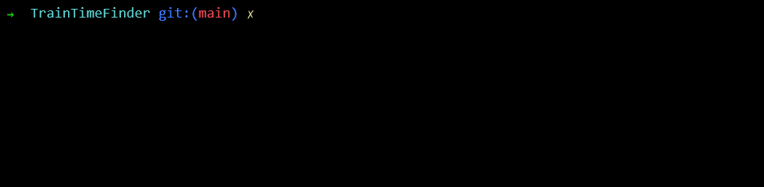

# Train Time Finder For TFW Services 

## What is this?
This is a python script that uses Transport For Wales' API to get the train arrival and departure times.

## How do I use this?
- `-h` Displays the help menu
- `-o` Is your origin station (the one you're at)
- `-d` Is your destination station (the one you're going to)

## Why did you make this?
Because I wanted to.

### Note
KeyError ['legs'] could mean that there's something wrong with TFW's API, or there's no trains running 
right now. If you're seeing this error and it's rather late at night, it's probably time to go to bed.
